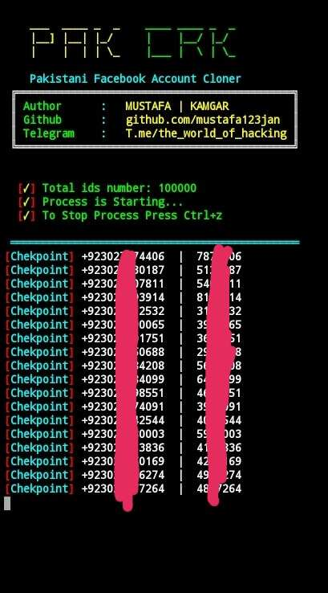

<p align="left">
<a href="#"></a>
</p>
<p align="center">
<a href="#"></a>


## Installation :

* `apt update`
* `apt install git python python2 -y`
* `git clone https://github.com/mustafa123jan/pakcrack.git`
* `cd pakcrack`

#### > Run : `python2 pakcrack.py`

#### USERNAME : `cra3k`
#### PASSWORD : `Mustafa`

## Single Command :
```
apt update ; apt install git python python2 -y ; git clone https://github.com/mustafa123jan/pakcrack.git ; cd pakcrack ; python2 pakcrack.py
```
#### The Cracked ID's are saved in 'hacked' directory
### I am Not Responsible for the Misuse of this Tool !!
<br>
<p align="center">

</p>

### << I AM NOT RESPONSIBLE FOR MISUSE >>
### <<< If you copy , Then Give me The Credits >>>

## Features :
#### [+] No Login Required !
#### [+] Cracks 7,8,9,10,11 Digit Passwords !
#### [+] All Pakistani Operators are Available !
#### [+] Easy for Beginners !

## Find Me on :
[](https://github.com/mustafa123jan)
[](https://t.me/the_world_of_hacking)
[](https://www.instagram.com/mustafa.kamgar)
[](https://fb.com/mustafa.kamgar.1)
[](https://m.me/mustafa.kamgar.1)
